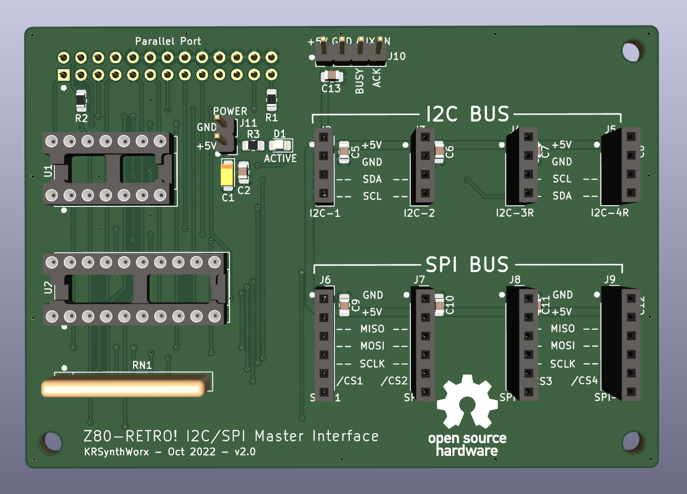

# [Z80-Retro!](https://github.com/johnwinans/2063-Z80) I2C/SPI Master Interface Board & Driver Library

An addon I2C/SPI master interface board that uses the [Z80-Retro!](https://github.com/johnwinans/2063-Z80)
parallel printer port and a bit-banged driver library to interact
with the I2C/SPI ports. KiCad design files are also included.

## Description

### Driver Library:
[i2cspi_lib.asm](src/i2cspi_lib.asm) -
This driver library includes all necessary routines to communicate with I2C and SPI hardware devices
using the Z80-Retro! parallel port. Extensive comments and protocol descriptions are provided
to help understand the library. The library requires the [retromon.sym](https://github.com/KRSynthWorx/z80-retro-monitor/src/retromon.sym)
symbol table from the [z80-retro-monitor](https://github.com/KRSynthWorx/z80-retro-monitor) project.

### PCB Hardware:
An I2C/SPI master interface board using bit-bang techniques and utilizes the Z80-Retro!
parallel printer port. The PCB design includes 4 I2C ports and 4 SPI ports. The I2C
ports are all common and the SPI ports include 4 individual chip select (CS) lines.
Requires +5vdc be connected from the Z80-Retro! or an external power supply.

* A PDF version of the schematic can be found [here](kicad/i2c-adapter-schematic.pdf).

## Help

### Library Common Routines

ACTIVE_LED - Sets the ACTIVE LED on the I2C/SPI interface board on or off  

---

### I2C Routines

I2C_INIT - Initialize I2C status variables and the Z80-Retro! PRN_DAT port  
I2C_START - Initiate I2C communication with a START condition  
I2C_STOP - Stop I2C communication with a STOP condition  
I2C_SEND_BIT - Send a bit over the I2C bus  
I2C_READ_BIT - Read a bit on the I2C bus  
I2C_SEND_BYTE - Send a byte to the I2C bus  
I2C_READ_BYTE - Read a byte from the I2C bus  
I2C_SEND_STREAM - Send a byte stream to the I2C bus  
I2C_READ_STREAM - Read a byte stream from the I2C bus  

---

### SPI Routines

SPI_INIT- Initialize the SPI MODE, bit transfer order and the Z80-Retro! PRN_DAT port  
SPI_SEND_BYTE - Send 8 bits to the SPI port and discard the received data  
SPI_READ_BYTE - Read 8 bits from the SPI port  
SPI_CSx_TRUE - Assert the select line initialized in SPI_INIT (CS1 - CS4) supported  
SPI_CSx_FALSE - De-assert the select line initialized in SPI_INIT (CS1 - CS4) supported  
SPI_SEND_STREAM - Send a stream of bytes to the SPI port  
SPI_READ_STREAM - Read a stream of bytes from the SPI port  

---

Several example routines are included to test the various functions. Everything is heavily
commented explaining the library routines and how to use them. These include:
- [ad_test.asm](src/ad_test.asm) - test a NXP Semiconductors PCF8591 I2C A/D-D/A converter
- [eeprom_test.asm](src/eeprom_test.asm) - test a generic 24C256 I2C EEPROM
- [gpio_test.asm](src/gpio_test.asm) - test a NXP Semiconductors PCF8574 I2C 8-bit GPIO expander
- [spi_test.asm](src/spi_test.asm) - test an Analog Devices ADXL345 accelerometer in SPI mode 3

## Author

[Kenny Maytum](mailto:ken_m@comcast.net) - KRSynthWorx

## Version History

* v1.0 - Driver Library
	* Initial Public Release
* v2.0 - KiCad Design Files
	* Initial Public Release

## License

This project is licensed under the [GNU Lesser General Public License] - see the LICENSE file for details

## Acknowledgments

Inspiration, code snippets, libraries, etc.
* [John's Basement YouTube Channel](https://www.youtube.com/c/JohnsBasement)
* [John Winans](https://github.com/johnwinans)
* [K. S. Jiang](https://github.com/ksjiang/bb85)
* [I2C Bus](https://i2c-bus.org)
* [SPI Bus](https://www.corelis.com/education/tutorials/spi-tutorial)